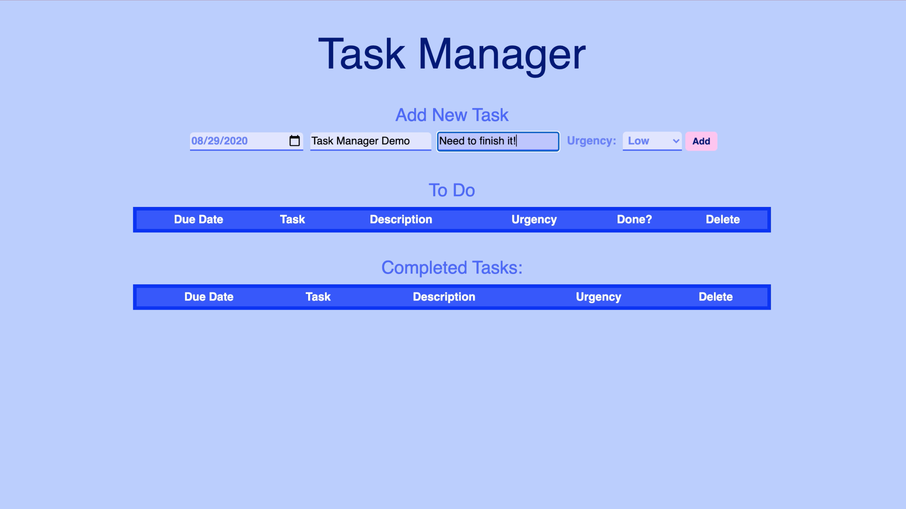
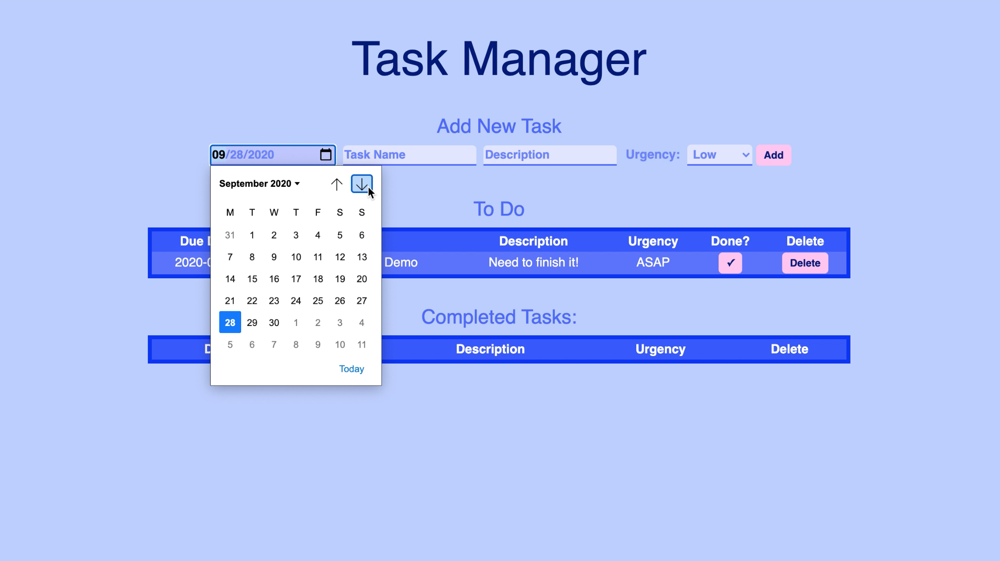
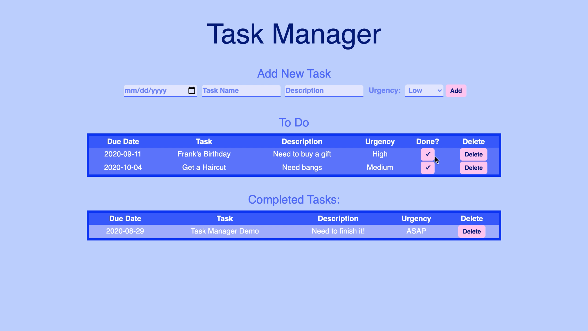

# Task Manager : To-Do List Application

### Built By:
Mase Santos
>Duration: Weekend Sprint

## Application Views

## Application Overview

This application serves as a minimalist task manager, with a generally monochromatic blue scheme for a calming experience. With this application, a user can CREATE new tasks in the task manager, READ all tasks in the database, UPDATE tasks to mark them as "Done," and DELETE tasks should they want to. This application was created over a weekend sprint, in order to show knowledge in ***JavaScript, jQuery SQL, Node, and Express.*** 

## Installation

1. Set-up 'weekend-to-do-app' DB using the provided SQL file
2. npm intall  
3. npm start

## Usage

1. Add tasks via the inputs at the top of the page
2. When a task is done, mark is as so with the check ***[✓]*** mark
3. To remove a task entirely, simply click the "Delete" button of the task you wish to remove

## Technologies Used

- JavaScript
- jQuery
- Node.js
- Express.js
- PostgreSQL/Postico

## Acknowledgement
Thank you to my instructors [Mary](https://github.com/mbMosman) and [Dev](https://github.com/devjanaprime), as well as the Paxos cohort at [Prime Digital Academy!](www.primeacademy.io)! 
